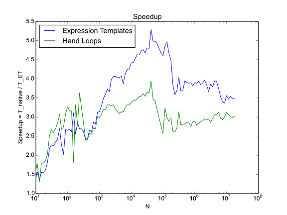

# ExpressionTemplates

Linux, OSX: 

This package provides Julia with deferred evaluation of array expressions using a C++-style Expression Template framework.
The purpose of the package is to greatly accelerate the evaluation of
vectorized expressions by eliminating allocation of intermediate calculations.
For example, for $\alpha,\beta,\gamma,\delta \in \mathbb{R}$, and $A,B,C,D,R \in \mathbb{R}^N$,
the expression
$$
R = \alpha A + \beta B + \gamma C + \delta D
$$
requires the construction of *seven* temporary arrays.
A more optimal way to compute this is to allocate an output array
and compute the result index-by-index.
Expression templates exploit the language's type system to do precisely this, thus
avoiding the overhead of intermediate array allocations.

For this model problem, I have found peak speedups of 5.25x over the native array evaluation,
while a simple hand-coded loop, such as the one described above, only achieves 4x (on my machine).
The benchmark showing the speedup of expression templates vs a hand-coded loop is shown in the image.

[]